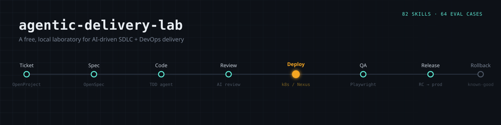
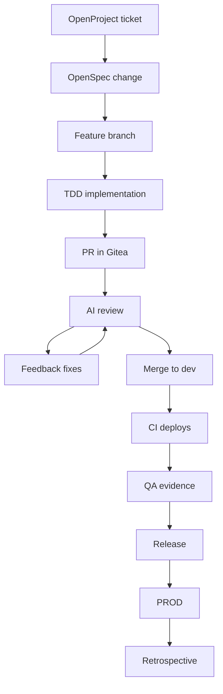
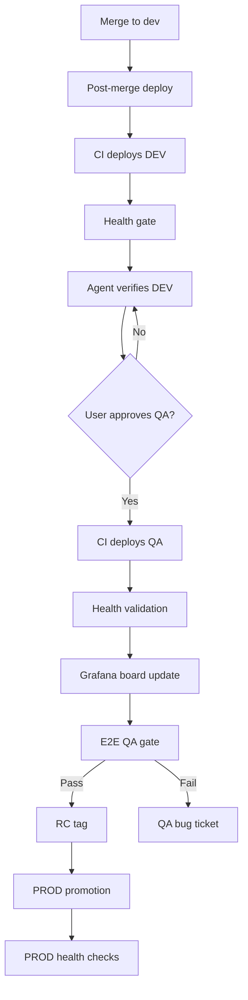

<div align="center">
  

  <h1>Agentic Delivery Lab</h1>
  <p><em>A free, local laboratory testing how far AI agents can drive a real SDLC + DevOps pipeline — ticket to production, evidence-based QA, zero vendor lock-in.</em></p>

  
  
  
  
  
  
</div>


# AI SDLC + DevOps Laboratory

A **free, local laboratory for testing an AI-assisted SDLC and DevOps workflow** end to
end — from ticket intake and specification to implementation, review, artifact
handling, deployment, QA evidence, release promotion, rollback, and operational
learning.

> This is a **laboratory**, not a production product template. It ships no application
> source code: the product stack is your choice, and the AI resolves the concrete
> scaffold after you pick it.

## Core Concepts

- **SDD / SDLC agentic shell** — this repository is a product-free *SDD/SDLC* shell
  (as described in [`AGENTS.md`](AGENTS.md)): the entire delivery workflow (ticketing,
  specification, implementation, review, deployment, release) is *defined in code and
  configuration* — routing rules in `AGENTS.md`, executable instructions as skills, and
  a deterministic helper CLI (`tools/sdd_cli`). Agents follow the defined flow instead
  of improvising.
- **Agentic shell / harness** — a product-free skeleton that turns an AI coding agent
  into a delivery worker: `AGENTS.md` routes requests to the right skill, skills carry
  the step-by-step contracts, and the CLI provides deterministic operations (install,
  setup, checks, manifests). The harness is stack-agnostic — you choose the product
  stack, and the harness drives delivery around it.
- **Memory** — three context layers: `docs/` (tracked human documentation: architecture,
  ADRs, workflows, conventions), `knowledge/` (agent-consulted operational memory:
  errors, fixes, patterns, lessons learned), and `openspec/specs/` (archived OpenSpec
  behavior specs, created on change archive). Durable context lives in the repo, not in
  chat history. See [`docs/conventions/context-management.md`](docs/conventions/context-management.md).
- **Skills** — 82 skills (in `.agents/skills/`) that encode the workflow stages:
  ticket start, OpenSpec change, implementation, review, QA, deploy, rollback,
  retrospective, and more.
- **Agent eval** — a deterministic Promptfoo suite (64 routing cases) that verifies the
  harness routes user requests to the correct skill. See the
  [Agent Eval](#62-agent-eval-verify-the-router) section.
- **QA as evidence** — a release to PROD requires executable proof: acceptance
  criteria validated by Playwright assertions against the deployed QA artifact, not
  just a human "it looks fine".

---

## 1. Goal — What This Lab Tests

The lab proves a full agentic delivery workflow using **free/open-source tools only**,
so you can exercise every concept below in one repeatable environment:

| Concept | What is tested |
| ------- | -------------- |
| **Ticketed SDLC** | Work packages in OpenProject (Specified → In progress → Developed → In testing → Closed) with generated markers and time telemetry |
| **Change specification** | OpenSpec proposals (`proposal.md`, `specs/`, `design.md`, `tasks.md`) and delta-spec sync |
| **AI skill-driven implementation** | 82 skills (see `manifest.json`) that drive planning, TDD, review, QA, deployment, rollback, and retrospective work |
| **Test-driven development** | RED/GREEN vertical cycles, three test levels (unit, integration, architecture), coverage gate (≥ 80%) |
| **PR review loop** | AI review agent with stable finding IDs, labels (`agent-reviewed` = clean, only when zero findings remain and the PR Validation run is green; `needs-tests`; `needs-changes`), PR Validation failures fed back as BLOCKER findings, feedback tasks, adversarial review, human review handoff |
| **CI/CD** | Gitea Actions pipelines that build immutable artifacts and deploy them |
| **Immutable artifacts** | Sonatype Nexus stores artifacts by commit SHA; the same artifact is promoted across environments — never rebuilt |
| **Multi-environment deployment** | DEV → QA → PROD on a local kind cluster (or Docker Desktop K8s), Kustomize overlays |
| **QA as evidence** | E2E QA gate: acceptance criteria proven by executable Playwright assertions against the deployed QA artifact |
| **Release promotion** | RC tags (`v1.2.3-rc.N`) → explicit final release (`v1.2.3`) to PROD only on user intent |
| **Rollback & hotfix** | Redeploy known-good artifacts, expedited hotfix lane from `main` |
| **Observability** | Grafana health dashboard, Seq log search, Dozzle container logs |
| **Quality gates** | Gitleaks (secrets), Semgrep (SAST), Trivy (SCA), Checkov (IaC), JSON validation — local and in CI |
| **Agent evaluation** | Promptfoo eval (64 routing cases) verifies the agent routes requests correctly |
| **Operational learning** | A `knowledge/` base that captures errors, fixes, patterns, and lessons learned for future agents |
| **Parallel delivery** | Optional multi-ticket coordination in isolated Git worktrees with a serialized deployment lane |

---

## 2. How To Use

> **One command, then prompts.** For everyday delivery work, the only manual terminal
> command is installing the template into a test repository (§2.1). Everything after
> that — lab setup, stack configuration, ticket work, deployments — is driven by
> **prompts to your AI coding agent**, which runs the underlying CLI commands for you.
> (Verification tools like the agent eval in §6.2 are the exception and are shown as
> commands.)

### 2.1 Install The Template (the only command)

From this lab repository, install the latest final release into a separate test repo:

```bash
python -m tools.sdd_cli template-installer install --target C:\path\to\test-repo
```

Install a pinned version, or update later:

```bash
python -m tools.sdd_cli template-installer install --version v0.1.0 --target C:\path\to\test-repo
python -m tools.sdd_cli template-installer update --version v0.2.0 --target C:\path\to\test-repo
```

If `--version` is omitted, the installer uses the latest final Git tag matching
`vMAJOR.MINOR.PATCH` (release candidates like `v0.1.7-rc.2` are ignored). The install
writes `.template/sdd-tool-version.json` (version, source commit, checksum, managed files)
and seeds `knowledge/README.md`. Test-project files (`.template/project-profile.local.json`,
secrets, product source, tests, OpenSpec changes) are preserved on updates.

### 2.2 Use Prompts In Chat

Everything else is a prompt. You ask, the agent runs the deterministic steps and asks
you only when a decision is required.

**Setup the lab environment.** The agent initializes local files, builds the CI runner
images, starts the services (Gitea, OpenProject, Nexus, Grafana, Seq, Dozzle), and
validates prerequisites:

```text
Set up the lab environment.
```

It runs automatically, end to end (idempotent — safe to re-run; `--dry-run` previews
first). The agent will ask you only if a prerequisite is missing (e.g., Docker not
running). The flow is detailed in
[`docs/workflows/setup-flow-plan.md`](docs/workflows/setup-flow-plan.md).

**Configure the product stack.** The template is **stack-agnostic** — no `package.json`,
`src/`, or Dockerfiles ship. Declare your stack explicitly (never auto-detected):

```text
Configure this repository for my sample project stack: frontend React,
backend FastAPI, database PostgreSQL.
```

The agent records your decision, creates the deterministic `src/` + `test/` skeleton,
and asks you to confirm the stack before scaffolding the stack-specific artifacts
(package manifests, test runners, Dockerfiles, CI workflows) via
`dev-flow-scaffold-project`. Details:
[`docs/workflows/supporting-workflows.md`](docs/workflows/supporting-workflows.md) §4.

**Deliver a ticket.** The delivery flow is **automatic**: you start it once, and the
agent drives every stage (refinement, branch, OpenSpec change, implementation, PR,
review, merge, deploy, QA evidence, release). You are asked only at the decision
points, for example:

- **Start a ticket** — you ask to start the next ticket; the agent selects it (or asks
  you which one), then automatically refines it, creates the branch, sets up the
  OpenSpec change, and moves it to `In progress`.
- **Confirm the stack** (once, before scaffolding).
- **Approve PROD promotion** — QA passing alone never releases; you must ask for it.
- **Choose a rollback target** during a rollback.

Start with any of these prompts — the rest is automatic:

```text
Start the next ticket.
Start implementation for ticket <ticket-key>.
Continue the delivery flow.
Create a pull request and run PR review for the current ticket.
Deploy the current ticket to QA and run the QA gate.
Promote the QA-approved release to PROD.
Check pipeline status.
Run a hotfix flow. / Rollback PROD to the previous release.
```

**You never need to know the other prompts.** When you are unsure of the next step,
just say **"continue with the dev flow"** (or *hotfix flow*, *rollback flow*, etc.) —
the routing table in `AGENTS.md` maps your request to the right skill and the agent
continues from where it stopped. For the full list of per-stage prompts, see the
routing matrix in
[`docs/workflows/implementation-deploy-flows.md`](docs/workflows/implementation-deploy-flows.md)
§2, and the stage details in [`docs/workflows/`](docs/workflows/README.md).

The lab services, once running:

| Service | URL | Container |
| ------- | --- | --------- |
| Gitea (Git + PRs + CI) | <http://localhost:3000> | `agentic-gitea` |
| Gitea MCP (shared HTTP) | <http://localhost:8123/mcp> | `agentic-gitea-mcp` |
| OpenProject (tickets) | <http://localhost:8080> | (openproject) |
| Nexus (artifacts) | <http://localhost:8088> | `agentic-nexus` |
| Grafana (dashboards) | <http://localhost:3001> | `agentic-grafana` |
| Seq (log search) | <http://localhost:5341> | `agentic-seq` |
| Dozzle (container logs) | <http://localhost:8888> | `agentic-dozzle` |

To stop the lab when done, ask the agent: `Stop the lab environment.`

---

## 3. Implement A Ticket

> **How it feels.** You start with one prompt — **"Start the next ticket"** (or
> "Start implementation for ticket `<key>`") — and the rest is automatic: the agent steps
> through the flow below and asks you only at decision points (ticket selection, stack
> confirmation, PROD approval, rollback target). You never need to know the steps in
> advance — say "continue with the dev flow" to resume.

A ticket moves through the flow below (each step is a skill the agent loads from
`AGENTS.md` → Workflow Stage Routing):



### Step-by-step

1. **Start the ticket** — the agent selects the ticket, runs the ticket-refinement
   gate, creates the branch, captures workflow telemetry, and curates an
   IA-generated ticket block (acceptance criteria, scope, validation expectations).
2. **Propose the OpenSpec change** — generates `proposal.md`, `specs/`, `design.md`,
   `tasks.md` (including a Review Workload Forecast) and verifies completeness.
3. **Implement** — vertical TDD cycles (RED before code), three test levels, the
   `/health` contract, and all quality gates (coverage ≥ 80, local CI loop) before the
   PR is created.
4. **Verify + review** — `dev-flow-verify-change` checks completeness/correctness/
   coherence; the PR review agent posts structured findings (`AI-001`…) and labels.
5. **Feedback loop** — every AI/human finding becomes an OpenSpec feedback task;
   fixes are committed with markers and re-reviewed until clean.
6. **Handoff** — approval is the automated gate: the ticket sits in `Developed`
   until the AI review is clean and `agent-reviewed` is applied (zero findings +
   green PR Validation); the human merges the PR to `dev` and the deployment
   flow takes over.

**Full details:**
[`docs/workflows/implementation-deploy-flows.md`](docs/workflows/implementation-deploy-flows.md) (Stages 1–6).

---

## 4. Deploy To DEV / QA / PROD

CI auto-deploys DEV when a PR is merged into `dev` (direct pushes to `dev` never deploy). QA is deployed only after
the agent verifies DEV and the user approves; promotion to PROD is **always explicit**.

| Environment | Namespace | Replicas | Trigger |
| ----------- | --------- | -------- | ------- |
| **dev** | `sdd-dev` | 1 | PR merged into `dev` |
| **qa** | `sdd-qa` | 2 | User-approved `package-deploy` dispatch after DEV verification |
| **prod** | `sdd-prod` | 3 | Explicit PROD deployment of the QA-approved artifact |

### The deployment sequence



1. **Post-merge deploy** — verifies the merge, triggers the CI pipeline, waits for the
   immutable Nexus artifacts (`app/{commitSha}/…`); the pipeline deploys **DEV only** with a `/health` gate.
2. **QA deploy** — sets the ticket to `Developed` before any deploy (hard gate), verifies DEV is healthy, **asks the
   user for approval**, dispatches the QA deployment on approval, validates it, writes the release manifest, and
   moves the ticket to `In testing`.
3. **Grafana board** — the SDD Service Status dashboard
   (`http://localhost:3001`, `uid: agentic-e2e-health-board`) is updated with the live
   DEV/QA/PROD URLs after every deploy (`grafana-board-update`).
4. **E2E QA gate** — `QA Done = acceptance criteria proven by executable assertions`:
   `BASE_URL="${QA_FRONTEND_URL}" npx playwright test`. PASS → RC tag + Done; FAIL →
   QA bug ticket.
5. **PROD promotion** — preflight (E2E evidence, artifact checksums, RC tag), fast-forward
   `main`, final annotated tag `vMAJOR.MINOR.PATCH`, deploy the **same artifact**, verify
   every app's `/health`.
6. **Rollback / hotfix** — rollback redeploys a known-good artifact (never a rebuild);
   hotfix branches from `main` with full quality gates.

**Full details:**
[`docs/workflows/implementation-deploy-flows.md`](docs/workflows/implementation-deploy-flows.md) (Stages 7–14) and
[`docs/architecture/deployment.md`](docs/architecture/deployment.md).

---

## 5. Quality Gates

Quality is enforced at three layers: **local hooks** (fast, developer-side), **local CI
loop** (reproduce CI on the dev machine), and **CI PR validation** (authoritative gate
on every pull request). No code merges until all three pass.

### 5.1 Local Hooks (lefthook)

| Hook | What runs |
| ---- | ---------- |
| **pre-commit** | `gitleaks protect --staged --redact` (secret scan on staged files), `npx trunk fmt apps` (formatting) |
| **commit-msg** | Commit message contract validation, `gitleaks detect` on full tree, `trunk check apps` (lint) |
| **pre-push** | `python -m tools.sdd_cli stack-tests` — unit + integration + architecture tests with coverage gate (≥ 80%, from `.template/quality.local.json`); skipped cleanly when no stack is configured |

These are the fast first line. They run on every commit and every push — no bypass
with `--no-verify`.

### 5.2 Local CI Loop (`sdd-e2e-ci:local`)

Before opening or updating a PR, the agent can reproduce the full CI gate set inside
the same Docker image the CI job uses. This catches errors cheaply:

| # | Gate | Tool | Scope |
|---| ---- | ---- | ----- |
| 1 | JSON validation | `python3 -m json.tool` | Every `*.json` in the repo |
| 2 | Secret scan | Gitleaks | Full working tree |
| 3 | SAST scan | Semgrep | `apps/`, `packages/` (rules from `.semgrep-rules.json`) |
| 4 | SCA scan | Trivy | `apps/`, `packages/` (vulnerability DB) |
| 5 | IaC scan | Checkov | `apps/`, `infra/k8s/`, `infra/deployment/`, `.gitea/` (config in `.checkov.yml`) |

All five gates must exit 0. Fix code, re-run from the start, push only when the loop
prints `ALL GATES PASSED`.

### 5.3 CI PR Validation (`.gitea/workflows/pr-validation.yml`)

The **authoritative full gate** — runs on every pull request (any target branch). Steps:

| Step | What it checks |
| ---- | -------------- |
| **JSON validation** | Every `*.json` parses via `python3 -m json.tool` |
| **Secret scan** | Gitleaks — repo-wide, exit 0 on clean |
| **SAST scan** | Semgrep — `apps/`, `packages/` only (skipped if absent) |
| **SCA scan** | Trivy — `apps/`, `packages/` only (skipped if absent) |
| **IaC scan** | Checkov — deploy + implementation folders (skipped if absent) |
| **Kustomize overlay validation** | Renders every env overlay, asserts NodePort uniqueness cluster-wide |
| **App registry validation** | `apps.json` schema + per-app Dockerfile existence + project-name prefix rule |
| **Dev flow gate** | Requires `agent-reviewed` label — set by the AI review agent only when the run is green and zero findings remain |

The `agent-reviewed` label gate ties the review loop to CI: the label is removed
ever the run is red/pending or findings exist, so a PR cannot merge until both the
AI review is clean and CI is green.

**Local vs CI split:** local hooks are fast feedback on touched behavior. Gitea PR
validation is the authoritative gate. The CI image intentionally has no stack runtimes
— product tests run via the lefthook pre-push hook on the dev machine.

---

## 6. Flows Explained Step By Step

### 6.1 The Flow Documents

The workflows are documented in [`docs/workflows/`](docs/workflows/README.md) and
mirror the routing contract in `AGENTS.md`:

| Flow | Document |
| ---- | -------- |
| Linear ticket → PROD flow (Stages 1–14: start ticket, propose change, implement, verify, review, feedback, post-merge deploy, QA, E2E gate, archive, QA bug, PROD, rollback, hotfix) | [`implementation-deploy-flows.md`](docs/workflows/implementation-deploy-flows.md) |
| Supporting workflows (resume, explore, pipeline status, scaffold, retrospective, docs maintenance, Grafana update) | [`supporting-workflows.md`](docs/workflows/supporting-workflows.md) |
| Optional multi-ticket parallel delivery (worktrees + deployment lane) | [`parallel-delivery.md`](docs/workflows/parallel-delivery.md) |
| Setup flow (`full-setup` / `setup-lab`) | [`setup-flow-plan.md`](docs/workflows/setup-flow-plan.md) |

**Routing table:** every user request maps to exactly one skill — see the
Workflow Stage Routing table in [`AGENTS.md`](AGENTS.md).

**Quality gates:** coverage, pre-push stack tests, commit-message contract,
local CI loop (`sdd-e2e-ci:local`), and PR validation — see
[`implementation-deploy-flows.md`](docs/workflows/implementation-deploy-flows.md) §7.

### 6.2 Agent Eval (Verify The Router)

The harness is validated by a deterministic **Promptfoo** suite that checks the routing
logic — given a scenario (ticket state, branch, PR, QA evidence, explicit request), the
router must return the expected skill. The eval is fully deterministic (no LLM calls).

You can run it with a prompt:

```text
Run the agent evaluation.
Open the agent eval report.
Verify that the workflow routing still works after my changes.
```

The agent runs the underlying commands for you (shown here for reference):

```bash
python -m tools.sdd_cli agent-eval run      # fails loudly, exits non-zero on failure
python -m tools.sdd_cli agent-eval view     # open the report in the browser
```

- **64 routing cases** (see `.agents/agent-evals/README.md` for the authoritative count)
  cover ticket lifecycle, edge cases, parallel delivery, deployment lanes,
  infrastructure validation, explicit workflow-stage requests, state-driven resume,
  frontend design skill activation, and regression.
- To verify cases without promptfoo, run the Python provider directly against the
  YAML assertions (see `.agents/agent-evals/`).
- After a PROD release, the eval runs as a post-PROD check and any routing regression
  feeds the retrospective → eval-driven-improvement loop.

Details: [`.agents/agent-evals/README.md`](.agents/agent-evals/README.md).

---

## 7. References

### 7.1 Documentation

| Topic | Document |
| ----- | -------- |
| Documentation index (architecture, ADRs, modules, APIs, workflows, conventions) | [`docs/README.md`](docs/README.md) |
| System architecture, sources of truth | [`docs/architecture/system.md`](docs/architecture/system.md) |
| Deployment topology, environments, CI/CD | [`docs/architecture/deployment.md`](docs/architecture/deployment.md) |
| Architecture decisions | [`docs/adr/README.md`](docs/adr/README.md) |
| Conventions (context management, development) | [`docs/conventions/README.md`](docs/conventions/README.md) |
| Agent-consulted knowledge base (errors, fixes, patterns, lessons) | [`knowledge/README.md`](knowledge/README.md) |
| Agent-enforced delivery policy | [`.agents/skills/_shared/delivery-contract.md`](.agents/skills/_shared/delivery-contract.md) |
| Agent eval (Promptfoo routing suite) | [`.agents/agent-evals/README.md`](.agents/agent-evals/README.md) |

### 7.2 Skills Catalog

The full skill manifest (82 skills across ticket, implement, review, QA, deploy,
monitor, security, test, quality, observability, kubernetes, and more) lives in
[`.agents/skills/manifest.json`](.agents/skills/manifest.json). Skills are the executable
instructions the agent loads per routing stage.

### 7.3 Tools & Tech Stack

- **AI workflow engine:** [OpenAI Codex](https://developers.openai.com/codex/),
  [Codex Agent Skills](https://developers.openai.com/codex/skills),
  [OpenAI Skills repository](https://github.com/openai/skills)
- **Change specs:** [OpenSpec](https://openspec.dev/)
- **Ticketing:** [OpenProject](https://www.openproject.org/)
- **Git + CI:** [Gitea](https://about.gitea.com/) and
  [Gitea Actions](https://docs.gitea.com/usage/actions/overview)
- **Artifacts:** [Sonatype Nexus Repository](https://www.sonatype.com/products/sonatype-nexus-repository)
- **Deployment:** [Docker Desktop](https://www.docker.com/products/docker-desktop/),
  [Kubernetes](https://kubernetes.io/), [kind](https://kind.sigs.k8s.io/)
- **Observability:** [Grafana](https://grafana.com/), [Seq](https://datalust.co/seq),
  [Dozzle](https://dozzle.dev/)
- **K8s dashboard:** [Headlamp](https://headlamp.dev/) — native desktop app that reads `~/.kube/config`
- **QA / E2E:** [Playwright](https://playwright.dev/)
- **Helper CLI:** [Python](https://www.python.org/) + standard library
  (`tools/sdd_cli`)

### 7.4 External Skills Used (attribution)

- [Caveman](https://github.com/JuliusBrussee/caveman/tree/main/plugins/caveman/skills/caveman) — terse, token-saving
communication
- [Domain Modeling](https://github.com/mattpocock/skills/tree/main/skills/engineering/domain-modeling),
  [Grill With Docs](https://github.com/mattpocock/skills/tree/main/skills/engineering/grill-with-docs),
  [TDD](https://github.com/mattpocock/skills/tree/main/skills/engineering/tdd) — planning and implementation
- [Ponytail](https://github.com/DietrichGebert/ponytail/tree/main/skills) — minimal-solution implementation
  and complexity review
- [OpenAI Playwright](https://github.com/openai/skills/tree/main/skills/.curated/playwright) and
  [Playwright Interactive](https://github.com/openai/skills/tree/main/skills/.curated/playwright-interactive)
  — browser automation
- [OpenAI Security Best Practices](https://github.com/openai/skills/tree/main/skills/.curated/security-best-practices)
  — secure-by-default review
- [Impeccable](https://github.com/pbakaus/impeccable) — frontend design guidance for AI coding agents
  (23 commands, 59 deterministic detector rules); wired into frontend implementation via
  `dev-flow-implement-ticket`

---

## 8. Considered But Not Adopted (Future Improvements)

Tools and concepts that were **evaluated or considered for the lab but not adopted** —
kept here as candidates for future improvements. Each is a single external dependency
(or service) the lab currently avoids in favor of deterministic, local, free tools;
none is required to run the workflows in this document.

| Tool / concept | Why deferred | Revisit when |
| -------------- | ------------ | ------------ |
| [mem0](https://github.com/mem0ai/mem0) — long-term agent memory (semantic + BM25) | The lab's memory is `docs/` + `knowledge/` — durable, reviewable, repo-based; an external memory DB is harder to audit. | Cross-session/cross-repo memory is needed. |
| [codebase-memory-mcp](https://github.com/DeusData/codebase-memory-mcp) — codebase knowledge graphs (tree-sitter, no LLM for code) | The shell previously **removed** MCP/search tooling; local grep + `knowledge/` cover today's needs with zero extra services. | Codebases grow large enough that grep costs more tokens than a graph query. |
| [bm25s](https://github.com/xhluca/bm25s) — fast BM25 lexical search over docs | The `knowledge/` base is small and curated; `knowledge_search.py` covers it without a search index. | `knowledge/` outgrows linear scans. |
| [OpenRouter](https://openrouter.ai/) — route LLM calls to cheaper/faster models per effort | The lab runs Codex directly and keeps the eval **deterministic (no LLM)**; no API key needed. | Cost-sensitive bulk runs or per-stage model tiering. |
| [RTK (Rust Token Killer)](https://github.com/rtk-ai/rtk) — compresses terminal output 60–90% before it hits the context window | The agent already runs commands with scoped outputs; adds a hook/proxy layer that can over-trim edge-case context. | Agent context runs hot on large test suites/CI loops. |
| Vector embeddings / RAG (e.g., [Chroma](https://www.trychroma.com/)) — semantic search | Conflicts with the lab's deterministic, no-vector-store principle; lexical + structural search cover the current scale. | Semantic recall on unstructured docs (PDFs, long-form notes) becomes a bottleneck. |

> **Why this list exists.** The shell intentionally **removed** MCP/search tooling
> (`feat: remove unused MCP/search tooling, add stack-driven test gate`) and keeps
> memory in-repo (`docs/` + `knowledge/`). These tools are recorded here so a future
> improvement can adopt them deliberately — with a reason — instead of reactively.
